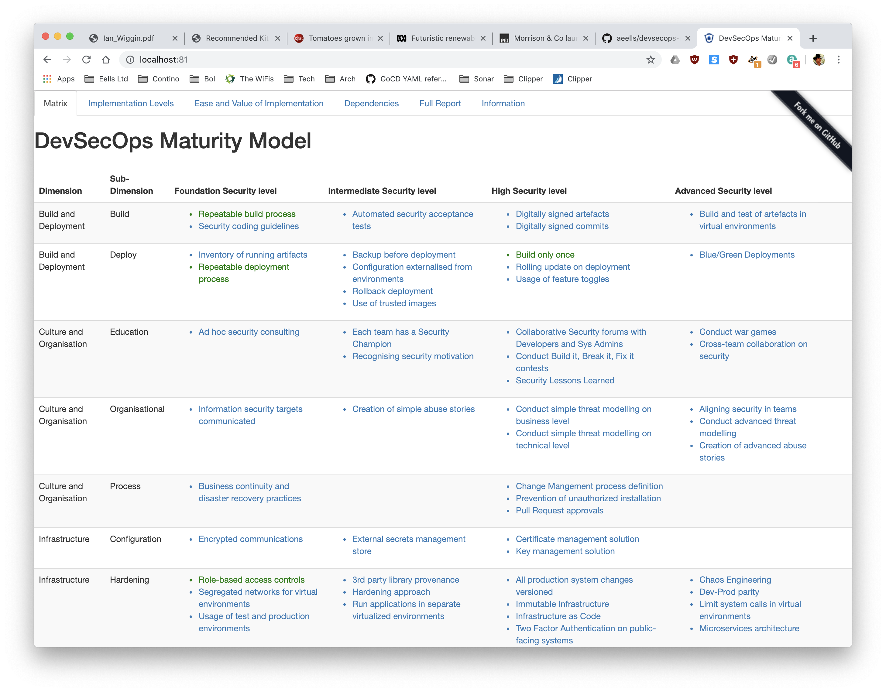
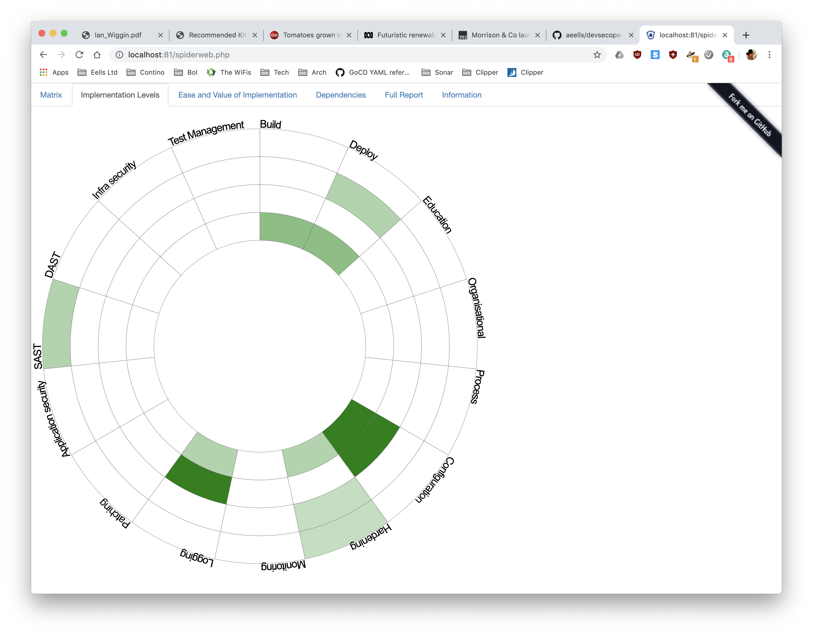

## DevSecOps Maturity Model

#### Kudos

All the kudos to JavaScript and PHP ninja [Timo Pagel](https://github.com/wurstbrot) for the initial fork of this [project](https://github.com/wurstbrot/DevSecOps-MaturityModel).

#### Build
    > ./build.bash
The Docker image only needs to built once. 

#### Run
    > ./start.bash
The Docker image mounts the `/content` dir straight to `/var/www/html` and serves the `index.php` file from there.

This means the content is served in-situ with no need to rebuild or restart Docker; simply refresh the browser after making changes.

Launch a browser to view the Docker container serving the `content/index.php` file on [localhost:81](http://localhost:81).

Useful implementation hints (tools, products, additional references) are available in the drill-down views (still a work in progress).

The model is stateful and implemented Security aspects can be captured on the Implementation Levels view. 

Remaining views (tabs) are still under assessment for level of benefit.

#### Useful References

https://info.whitehatsec.com/rs/675-YBI-674/images/0318-WebinarWH-TwelveFactorApp_AddendumChecklist.pdf

https://whatis.techtarget.com/definition/Confidentiality-integrity-and-availability-CIA

https://www.synopsys.com/blogs/software-security/wp-content/uploads/2018/08/IAST-DAST-SAST-RASP-info.jpg

https://tech.gsa.gov/guides/dev_sec_ops_guide/

https://hackernoon.com/applying-security-to-the-twelve-factor-app-753ce9a30379

#### 12 Factor App concerns applied to Security

###### I.    Codebase
- access restrictions (RBAC)
- branch PRs only (no master commits)
- review by 2 tech leads minimum
- externalise all configuration
- externalise all secrets (requires secure store)
- enforce secure coding guidelines eg. https://www.oracle.com/technetwork/java/seccodeguide-139067.html
- review and educate the team on secure coding guidelines

###### II.   Dependencies
ref https://techbeacon.com/app-dev-testing/13-tools-checking-security-risk-open-source-dependencies
- software composition analysis eg. OWASP Dependency-Check
- source-controlled version management of all 3rd party libraries
- dependency update automation eg. https://dependabot.com/
- licence adherence (legal risk)
- library provenance
- automate extraction of composition and liabilities
- integrate enforcement of risk acceptance policy into build pipeline

###### III.  Config
- externalise all configuration
- externalise all secrets (requires secure store)
- the security ‘gotcha’ can lie in the security of the environment itself (Cap IF)

###### IV.   Backing services
- least privilege authentication to all backend services
- account credentials stored securely
- all communication over HTTPS/TLS

###### V.    Build, release, run
- build stage is responsible for automating enforcement of the security policy, and breaking builds that fail it
- release stage should provide a consolidated view of the application’s risk, thereby allowing for a release ‘go/no-go’ decision
- run stage should provide capabilities to reduce business impact of exploited vulnerability (whether known or unknown)

###### VI.   Processes

###### VII.  Port binding
- avoid binding to privileged ports, instead using port forwarding to unprivileged ports
- immediately drop privileges once bound to a privileged port

###### VIII. Concurrency

###### IX.   Disposability
- confirm automated restarts after crash
- apply signatures and expire any derived security tokens

###### X.    Dev/prod parity
- enforce secrets and config management and separation
- replicate *all* prod security services (authentication/authorisation) in dev/qa/stage

###### XI.   Logs
- each security critical event logged with supporting information
- ‘SECURITY’ log record category to assist in aggregation
- automated log retrieval does not compromise servers eg. with manual SSH access

###### XII.  Admin processes
- treat backoffice admin tasks as first-class citizens; apply the same concerns as I. to XI. above
